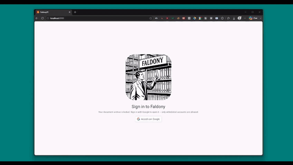
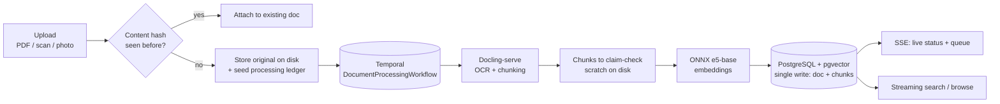
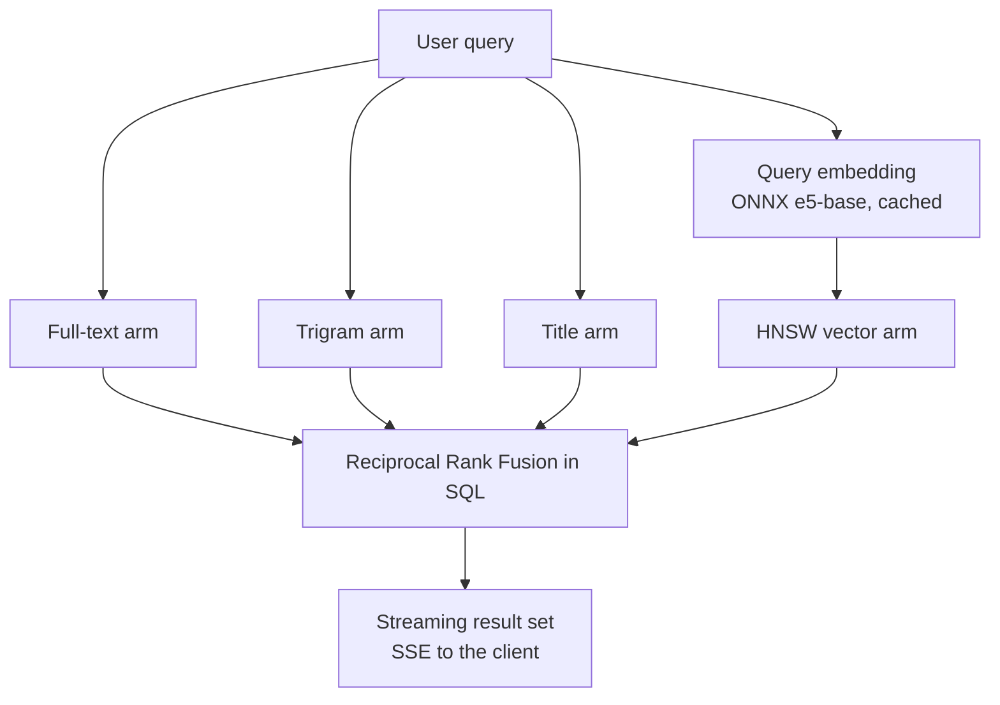

# Faldony

<p align="center">
  
</p>

<p align="center">
  
</p>

<p align="center">
  
  
  
  
  
  
</p>

<p align="center">
    
    
</p>

**A self-hosted, local-first document retrieval system.**

Faldony is a self-hosted document retrieval system for personal archives. It
ingests heterogeneous documents (PDF, scans, photographs), extracts structured
text via OCR, and indexes it alongside dense embeddings into a single
PostgreSQL dataset. Retrieval fuses BM25 full-text, fuzzy trigram, and HNSW
vector search arms within one SQL query, ranked by Reciprocal Rank Fusion.
Ingestion runs as durable Temporal workflows; originals, chunks, and the
index never leave local storage.

<p align="center">
  
</p>


## Contents

- [What it is](#what-it-is)
- [Design philosophy](#design-philosophy)
- [Key features](#key-features)
- [How it works](#how-it-works)
- [Intelligent retrieval](#intelligent-retrieval)
- [Technology stack](#technology-stack)
- [Deployment](#deployment)
- [Frontend](#frontend)
- [Why this architecture](#why-this-architecture)
- [Status](#status)
- [Could Add Later (Future Considerations)](#could-add-later-future-considerations)
- [Contributing](#contributing)
- [License](#license)

---

## 💡 What it is

Faldony is a single-user document management system:

- **Ingest anything** — scan a document, photograph a page, or drop in a PDF.
  Uploads are deduplicated by content hash, sniffed for type, and processed
  automatically.
- **A rich document model** — titles, parties (people/companies), tags,
  collections with explicit ordering, page counts, and full-text content.
- **Find it fast** — a live, streaming search over your entire library, plus
  filterable/browsable views that update as documents arrive.
- **Get it back out** — download originals (with integrity verification),
  preview in place, and export exactly what you need, when you need it.

Faldony serves any archive of personal or professional documents that wants
local storage, hybrid retrieval, and durable processing: receipts and bills,
medical records, contracts, research papers, scanned correspondence. It is a
document management system first, with the privacy posture of a binder that
happens to be searchable.

---

## 🧠 Design philosophy

Faldony is deliberately engineered around four constraining choices:

1. **Your data never leaves your machine.** No cloud sync, no third-party
   storage. Documents, chunk text, and embeddings live in *your* PostgreSQL
   instance on *your* disk.
2. **One database does everything.** No Elasticsearch, no separate vector
   database — PostgreSQL (with `pgvector`) is the single data layer for
   metadata, full-text search, trigram search, and vector search.
3. **One machine is enough.** The whole stack is containerized for a
   single-node deployment on modest hardware — a typical home server or a
   small mini PC — with a Raspberry Pi-class board as a plausible target
   (arm64 images across the stack), though not yet validated there; see
   [Status](#status). The application stays exposed to other devices on the
   same network or, optionally, to the internet.
4. **A modular monolith with external infrastructure dependencies.** Faldony
   is not a microservice fleet: the backend is one Spring Boot process that
   owns the domain logic (services, repositories), the auth layer (OAuth2
   resource server), the gateway role, and the Temporal worker. PostgreSQL,
   Temporal, Docling, and the frontend's nginx are *infrastructure* — shared
   engines the monolith depends on, not cooperating application services.
   Each component has a clear, bounded responsibility, and the system is
   composed, not scaled: there is no DB-per-service, no independent release
   cycles, no per-service horizontal scaling.

---

## ✨ Key features

- **Hybrid intelligent retrieval** — full-text (BM25), fuzzy trigram, title
  similarity, and semantic vector search fused by Reciprocal Rank Fusion
  (RRF), all in a single SQL query. *See [Intelligent retrieval](#intelligent-retrieval).*
- **Durable document processing** — every upload is a Temporal workflow with
  typed failure staging, automatic retries of transient faults, cooperative
  cancellation, and a persistent processing ledger.
- **On-device embeddings** — a multilingual ONNX embedding model
  (768-dim, `intfloat/multilingual-e5-base`) runs locally, baked into the
  container image; no API keys, no network calls for indexing or querying.
- **Content-addressed archive** — dedup by SHA-256; a "row exists" invariant
  means a document is either fully processed or not present.
- **Integrity by default** — downloads are re-hashed against the stored
  record; a mismatch deletes the object and the row rather than serving
  corrupted data.
- **Live progress** — uploads stream their stage through Server-Sent Events,
  bridged from durable Temporal workflow state; in-flight work survives
  restarts.
- **Secure by default posture** — OAuth2 (Google) resource server with an
  allow-list that fails closed in production, per-IP rate limiting, and
  request-ID correlation across logs and packet captures.
- **Self-documenting API** — every endpoint carries OpenAPI 3 annotations;
  Swagger UI and `/v3/api-docs` are served publicly.

---

## ⚙️ How it works



An upload becomes a `DocumentProcessingWorkflow` — one durable execution per
document, identified by its content hash (duplicate uploads simply attach to
the running execution instead of re-processing).

<details>
<summary><b>Pipeline, step by step</b></summary>

1. **Extract** — the file is submitted to a local Docling server for OCR
   (Italian + English) and chunking into 512-token markdown-aware chunks.
   Polling is a durable `Workflow.sleep`, so a conversion restart or crash
   costs nothing; vanished server tasks are resubmitted automatically.
2. **Embed** — chunks are embedded on-device with the multilingual e5 model,
   with correct `query:`/`passage:` prefixing (this is load-bearing for e5)
   and batch-resumable heartbeats.
3. **Finalize** — a single database write creates the document row and all
   chunk rows (title + body, embeddings downcast to fp16 `halfvec`), then the
   scratch data is deleted. *A row existing == a fully processed document.*

Every side effect lives in an **activity**; the workflow itself performs no
I/O. A Saga compensation registered first thing guarantees cleanup on any
permanent failure, and cancellation is cooperative — a signal, never a
terminate — so cleanup always runs. Failures are classified into typed,
durable ledger entries (`processing_ledger`) that survive the workflow's
lifetime and drive automatic, health-gated retries of transient faults.

**The reconciler** — a separate Temporal Schedule runs every five minutes and
doubles as the system's self-healing pass: garbage-collects orphaned objects
and old scratch, terminates workflows that outlived their documents, removes
zombie rows, backfills missing embeddings, and — only when Docling is
healthy — resumes transiently failed uploads without requiring re-upload.

**Reliable progress, visible after the fact** — because Temporal's
*open-workflow* visibility is ephemeral, Faldony projects every stage
transition into a durable ledger. The UI's processing queue streams live
`task` events straight from workflow state (via [Temporal Workflow
Streams](https://github.com/temporalio/sdk-java/tree/master/temporal-workflowstreams)),
while history and per-upload retry (even *after* a failure, with the original
job spec) come from the ledger.

</details>

---

## 🔍 Intelligent retrieval

Faldony is a **retrieval** system — it finds and ranks documents for you; it
does not generate answers. There is no LLM pipeline here: the intelligence is
in *how* documents are indexed and ranked.

Every user query runs **four retrievers in a single PostgreSQL query**:

| Retriever | Technique |
|---|---|
| **BM25 (full-text)** | stemmed `tsvector` search over chunks |
| **Trigram (fuzzy)** | `ILIKE` + trigram similarity for typo-tolerant, substring matching |
| **Vector (semantic)** | cosine distance over 768-dim `halfvec` embeddings in an HNSW index |
| **Title** | trigram word-similarity against titles, with a boosted rank weight |

Each retriever produces an independent ranking; results are fused with
**Reciprocal Rank Fusion** (classic `k = 60`) inside the database, with a
boosted title arm. Ranking happens in SQL — no application-side merging, no
result-set shuffling — over a bounded window, so one long document can never
monopolize the results. Relevance scores are used for ordering *only* when
the user searches; browse mode (no query) is uncapped and purely
metadata-driven.

Why no separate vector database? Indexing, retrieval, and metadata live next
to each other, updated in the same transaction that creates the document —
there is no index lag, no pipeline to reconcile, no second service to back
up or secure. The searchable state is exactly the database state, always.
The cost is a heavier per-query SQL statement and tuning attention (HNSW
`ef_search`, trigram thresholds), which a single-node archive can afford.



<details>
<summary><b>Chunking and ranking depth</b></summary>

**Multi-chunk documents.** Docling chunks each document into many
512-token, markdown-aware body chunks (OCR `ita` + `eng`, merged peers,
tables kept); the document's title is stored as an additional first chunk.
Search matches at *chunk* level, then each retriever reduces its chunk ranks
per document (`MIN` of chunk ranks) so a document is ranked once — a document
with many matching chunks can never swamp the fused list.

**Fixed query window — `k`.** Every retriever over-fetches `4 × k` chunks,
dedups to per-document ranks, and caps at `k` documents; only those enter the
RRF union. `k` is a deployment constant set to **500** (`faldony.search.window`)
and is never exposed to clients — the SSE `done` event just reports whether
more matches may exist beyond the window.

**Fusion knobs.**

| Knob | Value | Meaning |
|---|---|---|
| RRF constant | `k = 60` | classic reciprocal-rank-fusion constant, in SQL |
| Title boost | `3.0` | multiplies the title arm's RRF contribution |
| Over-fetch | `4 × k` chunks | per-retriever chunk depth before document dedup |
| HNSW `ef_search` | `200` | semantic candidate breadth (database-level default) |
| Trigram word-similarity threshold | `0.3` | title `%>` GIN recheck threshold (database-level default) |

</details>

---

## 🛠️ Technology stack

| Layer | Technology |
|---|---|
| **Backend** |  Kotlin &middot;  Spring Boot Web Starter (MVC, Java 25, virtual threads) &middot;  Spring AI &middot; springdoc (OpenAPI 3, Swagger UI) |
| **Orchestration** |  Temporal (Java SDK, single worker, Workflow Streams) |
| **Data layer** |  PostgreSQL 17 +  `pgvector` (HNSW + `halfvec`) &middot;  Flyway &middot; JPA/Hibernate &middot; trigram/FTS indexing |
| **Document conversion** | Docling (`docling-serve`, self-hosted via  Docker) |
| **Embeddings** |  ONNX `intfloat/multilingual-e5-base`, on-device, 768 dims |
| **Frontend** |  Kotlin Multiplatform &middot; Compose Multiplatform (**Wasm/Web**,  Material 3 UI + Material Design icons) &middot;  Ktor client with SSE &middot;  FileKit (native file picker) |
| **Deployment** |  Docker Compose &middot;  Gradle, single-node, health-checked services |

The entire stack is one `docker-compose.yml`:  PostgreSQL,  Temporal server, Docling, and the backend itself (plus optional debugging helpers). The embedding model is downloaded once at image build time and cached as an image layer — no runtime downloads, no model cache volume.

<details>
<summary><b>Backend dependencies, in full</b></summary>

- **Spring Boot** — `spring-boot-starter-web` (MVC), `spring-boot-starter-data-jpa`
  (JPA/Hibernate, `ddl-auto: validate` — Flyway owns the schema), `spring-boot-starter-validation`,
  `spring-boot-starter-cache` (Caffeine), `spring-boot-starter-actuator`,
  `spring-boot-starter-oauth2-resource-server`, `spring-boot-flyway`
- **Flyway** — `flyway-core` + `flyway-database-postgresql`; migrations own
  every schema object (incl. indexes, triggers, search-config, GUC defaults)
- **Spring AI** — `spring-ai-starter-model-transformers` for on-device ONNX
  embeddings, run via DJL with the `onnxruntime` engine
- **Temporal** — `temporal-spring-boot-starter`, `temporal-sdk`,
  `temporal-workflowstreams` (durable status topic bridged to SSE)
- **Data** — `postgresql` JDBC driver, `pgvector` (halfvec/HNSW bindings)
- **Search support** — Apache Tika (upload MIME sniffing), springdoc-openapi
  (OpenAPI/Swagger UI)
- **JSON** — Jackson 2 pipeline (databind + Kotlin module + JSR-310)
- **Hardening** — Bucket4j (per-IP token-bucket rate limiting), `kotlin-reflect`
- **Tests** — Testcontainers (isolated PostgreSQL), JUnit 5, Mockito + Kotlin

Toolchain: Kotlin 2.3, Java 25 toolchain, virtual threads enabled, Gradle
with a version catalog (`libs.versions.toml`).

</details>

<details>
<summary><b>Frontend dependencies, in full</b></summary>

- **Kotlin Multiplatform** — single **Wasm (wasmJs)** browser target today;
  shared `commonMain` keeps desktop/mobile open
- **Compose Multiplatform for Web** — Material 3 UI, Material Design icons
  (`material-icons-extended`, Outlined set)
- **Ktor client** — `ktor-client-js` engine (wasmJs variant); kotlinx-serialization
  (ContentNegotiation), `HttpTimeout` for plain calls, a dedicated SSE-plugin
  client for streaming, `defaultRequest` Bearer token injection
- **FileKit** — `filekit-core` + `filekit-dialogs` for the native file
  picker on WASM
- **Browser interop** — `kotlin-browser` wrappers (`kotlinx.browser` DOM
  bindings: `window`/`document` access, media-query observation, GIS sign-in
  button, preview iframes)
- **State/plumbing** — `androidx-lifecycle` (viewmodel-compose),
  `multiplatform-settings` (persisted token/theme), `kotlinx-datetime`
  (timestamp formatting), coroutines/Flow (`debounce`, `flatMapLatest`,
  `stateIn`)

</details>

---

## 📦 Deployment

```bash
git clone <repository-url>
cd faldony
docker compose -f deploy/docker-compose.yml up -d --build
```

> [!TIP]
> **Disable the auxiliary services for production.** `docker-compose.yml`
> ships with two helpers for debugging: `log-writer` (streams compose logs to
> `deploy/logs/`) and `netshoot` (captures full packet payloads to
> `deploy/pcaps/`). Both write continuously and silently — they can eat disk
> space quickly and the packet captures contain raw traffic, so leave them
> off unless you are actively debugging: comment out the "Helpers" block, or
> stop them with `docker compose -f deploy/docker-compose.yml stop log-writer netshoot`.

> [!TIP]
> The first build downloads the ~1.1 GB embedding model from Hugging Face
> once; it is cached as an image layer, so subsequent rebuilds don't re-fetch
> it — only your code changes recompile. For capacity planning: the running
> stack needs roughly **20 GB of disk for images** — backend ≈ 2.7 GB
> (includes the baked model), Docling ≈ 15 GB, Temporal ≈ 0.8 GB, PostgreSQL
> ≈ 0.6 GB, plus ~1.1 GB of optional debugging helpers. Your archive's
> `deploy/data` adds its own footprint on top.

> [!NOTE]
> **Docling, CPU vs GPU.** The default `docling-serve` image is CPU-only and
> by far the largest image in the stack. If the host has an NVIDIA GPU, swap
> the service to the CUDA variant of the `docling-serve` image (with
> `runtime: nvidia`) — document conversion becomes significantly faster at
> the cost of a larger image. See the Docling docs for the current CUDA image
> name.

The client then talks to the backend on `http://<host>:8081`. Everything
runtime — uploaded originals, claim-check scratch, compose logs, packet
captures — lands under `deploy/` and is ignored by git.

### Frontend: production vs development

The frontend is a **wasmJs** (Compose Multiplatform / WebAssembly) app; the
browser only ever talks to its **own origin** (`:8080`) — the serving layer
proxies `/api` to the backend container. Two ways to run it:

**Production (compose service, nginx)** — pre-built static bundle:

```bash
docker compose -f deploy/docker-compose.yml up -d --build frontend
```

- `frontendKMP/Dockerfile` compiles `wasmJsBrowserDistribution`, hashes the
  loader, strips dev-only source maps, pre-compresses with gzip; the runtime
  stage is `nginx:alpine` serving the dist + `/api → backend:8081` proxy.
- `GOOGLE_CLIENT_ID` is **required at build time** (baked via
  `generateAuthConfig`; compose passes it from `deploy/.env`).

**Development (host, live-reload)** — Docker Desktop's VM filesystem is too
slow for an in-container dev server, so the dev loop runs natively:

```powershell
# 1) backend stack up (postgres/temporal/docling/backend; backend publishes :8081)
docker compose -f deploy\docker-compose.yml -p deploy up -d backend

# 2) dev server on the host (hot-reload on save)
$env:GOOGLE_CLIENT_ID = (Select-String -Path deploy\.env -Pattern '^GOOGLE_CLIENT_ID=').Line -split '=',2 | Select-Object -Last 1
cd frontendKMP
.\gradlew.bat wasmJsBrowserDevelopmentRun --continuous
```

- `frontendKMP/webpack.config.d/dev-proxy.js` forwards `/api` to the
  host-published backend (`localhost:8081`) — same single-origin contract as
  prod.
- Keep one "page provider" on `:8080` at a time (dev server or prod nginx).
- More detail (MIME/cache gotchas, pcap scope) in
  `my notes/FRONTEND_DEPLOY.md`.

`GOOGLE_CLIENT_ID` is mandatory for both modes — the Gradle build fails fast
without it (prod reads it from compose, dev from your shell).

- **Hardware:** designed for a single machine — but budget for the whole
  stack, not just the backend. With the ~1.1 GB ONNX model loaded, the
  backend alone sits around 4–5 GB of RSS (JVM heap + native ONNX session),
  and Docling adds a few more gigabytes of spike while OCR'ing; an **8 GB
  host is the comfortable floor**, while 4 GB means running on zram/swap
  (a stretch, not a recommendation). A Raspberry Pi 4 (8 GB) is expected
  to run the stack thanks to arm64 images end to end, but that is a
  theoretical target, not yet validated — see [Status](#status). Document
  conversion throughput is the most resource-sensitive part (see the GPU
  note above for an optional boost).
- **Network access:** the backend exposes HTTP on the compose network; when
  published, the frontend's nginx acts as the gateway, and the wider
  deployment can layer its own gateway/nginx in front. The client's API base
  URL is fixed to its own origin (proxied), so no cross-origin plumbing is
  needed.
- **Auth:** OAuth 2.0 with Google as a federated identity provider, rather
  than a bespoke account system — identity comes from an established IdP,
  validated as a JWT resource server against Google's real OIDC endpoint,
  with a configurable allow-list that fails closed (an empty allow-list
  denies every identity, always).

#### Token flow and lifecycle

Faldony is a stateless OAuth2 **resource server**: it never issues, stores,
refreshes, or revokes tokens — every request carries a Google-issued
id_token (~1 h `exp`) validated per-request by Spring Security's **Nimbus**
decoder (signature vs Google's JWKS, `exp`/`nbf`/`iss`/`aud`, with `aud`
bound to the configured client id). The identity is then checked against
`FALDONY_AUTH_WHITELIST` (`sub` or email): allowed → `ROLE_APPROVED`,
else `403`; missing/invalid/expired → `401`. When a token expires, the next
request 401s and the frontend falls back to Google sign-in (reactive logout,
no refresh flow). No sessions, no cookies, no token store — security is
entirely per-request JWT validation.

---

## 🖥️ Frontend

The client is a  **Kotlin Multiplatform** application built with **Compose
Multiplatform for Web** — the same language, data model, and coroutines as
the backend, with platform-specific behavior isolated behind `expect/actual`
adapters. It currently ships as a browser app; the shared-`commonMain`
structure keeps future targets (desktop, mobile) open without rewriting the
UI or API layer.

The client communicates with the backend exclusively through  **Ktor**:
regular HTTP for CRUD and upload, and a dedicated **SSE** connection for
live, incrementally-rendered search results and per-upload processing
progress. The UI is a rich, local-session application — filterable
autocomplete controls, live-updating document table with sortable columns, an
in-place preview drawer (PDFs, images, text), a processing queue with live
stage chips and retry/cancel, and theme/persistence via browser storage. It
is intentionally *not* an SEO-oriented public website: it is a client for
your own archive, on your own network.

---

## 🏗️ Why this architecture

- **Sovereignty.** Documents, index, and vectors stay on hardware you own.
  There is nothing to "leak" from a third-party server, and nothing to lose
  when the internet goes down.
- **Operational simplicity.** One database, one worker, one compose file.
  Backup = back up `deploy/data` + PostgreSQL. The system is boring in the
  best way: few moving parts, no index-lag problem, no vendor APIs.
- **Durability by design, not by luck.** Temporal's durable execution means a
  document that was mid-conversion during a power cut is not lost — the
  workflow resumes, and the reconciler catches anything left behind. Long
  operations (OCR, embedding) are orchestrated, cancellable, and observable,
  which is precisely the class of problem Temporal excels at.
- **Honest trade-offs.** Hybrid search in SQL trades statement complexity for
  a drastically smaller footprint; single-node deployment trades horizontal
  scale for zero distributed-system ceremony — a deliberately fair exchange
  for a single-node service.
- **A modular monolith, not a platform.** The application logic lives in one
  deployable backend (domain, auth, gateway role, Temporal worker); the
  surrounding containers — PostgreSQL, Temporal, Docling, the frontend's
  nginx — are external infrastructure dependencies with well-defined
  interfaces. It was never meant to be split into infinitely scalable
  microservices: the architecture optimizes for clear module boundaries and
  predictable behaviour within that whole, not for unbounded parallelism.
- **Observable and easy to modify.** The project is in beta and the
  architecture reflects it: logs are retained under `deploy/` for post-hoc
  analysis, packet-capture helpers run alongside the stack, and every
  request carries an `X-Request-Id` for cross-log correlation. Components
  stay small and replaceable on purpose, so the system remains
  straightforward to adapt, experiment with, and contribute to while it is
  still evolving.

---

## 🧪 Status

Faldony is in **beta** — a functional foundation that is still being
hardened, and the architecture is candid about it (see
[Why this architecture](#why-this-architecture)):

- **Backend:** the core flows (ingestion, hybrid retrieval, durable
  processing ledger, self-healing reconciliation) are functional and
  exercised routinely, but test coverage is not yet comprehensive and
  behaviour can still change as the stack stabilizes.
- **Frontend:** usable end-to-end, yet the least mature part of the project;
  polish and feature work are ongoing, with desktop/mobile targets planned on
  top of the existing `commonMain` structure.
- **Dormant features:** the embedding-backfill workflow is implemented but
  gated on a degraded-vector repair trigger.
- **Platform validation:** every image in the stack publishes an arm64
  variant, so a Raspberry Pi 4 (8 GB) is the intended low-end reference
  host; on-device validation is planned but has not been performed yet.

---

## 🔮 Could Add Later (Future Considerations)

Ideas that fit the project's direction but are not implemented yet:

- **Frontend Collection** — implement collection logic in frontend (TOP priority)
- **Hierarchical tags** — tag hierarchies instead of a flat list
- **Nested collections** — collections inside collections
- **Full-text search within a collection** — scoped search over a single
  collection's documents
- **Bulk operations** — tag all documents in a collection at once, export a
  collection as a ZIP
- **Collection annotations/notes** — free-text notes attached to a collection
- **HTTPS in the frontend** — terminate TLS at the serving layer so the
  browser app (and its SSE streams) run over `https://`
- **Multilingual frontend** — the UI already routes every label through
  Compose string resources (`Res.string.*`), so adding locales is a matter
  of translating the string table and wiring up locale selection + persistence;
  no UI code changes needed

---

## 🤝 Contributing

**Contributors are welcome — the project needs them.** Faldony is at the
stage where outside help goes the furthest: the backend is being hardened,
and the frontend (the least mature part of the stack) has plenty of polish
and feature work — a good place to start is one of the
["Could Add Later"](#could-add-later-future-considerations)

See [`CONTRIBUTING.md`](CONTRIBUTING.md) — the standard GitHub flow applies:
open an issue first, ask to be assigned, then submit a PR. Scope guidance and
a worked contribution walkthrough are in that file.

---

## 📜 License

GPL-3.0 — see [`LICENSE`](LICENSE). Third-party attributions in [`NOTICE.md`](NOTICE.md).

---

<div align="center">
  <p>Made with ❤️ by <a href="https://github.com/SixthPhilosopher">SixthPhilosopher</a></p>
  <p>If you find Faldony helpful, please consider giving it a ⭐️</p>
</div>
